# [is0xBiVote](https://is0xbivote.web.app)

  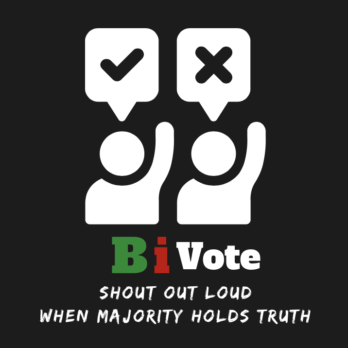

## Table of Contents
* [About the Application](#about-the-application)
* [Getting Started](#getting-started)
* [Usage](#usage)
* [Demo](#demo)
* [Developed By](#developed-by)

## About the Application
As social media becoming more popular and developing to be a life necessity, people read various news accross the world daily. Nowadays, everyone can receive new information easily and rapidly. Unfortunately we don't hava a chance to understand the context, dig into a news or even think about it mindfully since we need to accept next news in a short period of time.
  
Why don't we talk more about the topic you and me are concerned about?
  
_BiVote_ is a pure debate forum for community. The application provides trending and popular topics monthly for the public to vote and share their opinions. User can visit the website on desktop, tablet or mobile, since the application has a competent responsive design. The voting process is followed by _1st Vote_, _Read Posts_, _2nd Vote_, _Share Opinion_. Voters can select _YES_, _NO_, _NO IDEA_ or _NOT INTERESTED_ for during a vote. Furthermore, user can upvote the post they agree with to encourage the writters to speak out their thought. History searching is supported which includes searching by date and keyword. To have a better understading on the pulic attitude towards the certain vote, _BiVote_ provides statistic which includes _Leading Side_, _Inspired by Others_, _Hard To Tell_ and _Not Interested_. To improve the user experience, _Total Votes_, _Times Being Majority_ and _Total Upvotes_ are recorded in the profile page.

## Getting Started
- Visit the website
  > [BiVote](https://is0xbivote.web.app)
- Install node_modules via package.json
  > Type in terminal: `npm install`
- Initialize the json-server and start the live-server
  > Type in terminal: `npm start`
- View in your browser
  > Go to `http://localhost:3000`
  
## Usage
- **Login**
  - ***Login***: Require username and password and the authentication is verifed by JWT which would be stored in browser cookie.
  - ***Forgot Password***: Send a rescue password to user's email.
  - ***Register***: Requrie username, email and password.
- **Profile**
  - ***View***: Display account information.
  - ***Edit***: Email and password. Yet, username is unchangable.
  - ***Log Out***: See you next time!
- **Vote**
  - ***1st Vote***: Vote by intuition.
  - ***Read Posts***: Have a look on others' point of views
  - ***2nd Vote***: Only this vote would be counted.
  - ***Share Opinion***: Publish your thought and let people see it.
- **Post**
  - ***Post***: Publish your thought and let people see it.
  - ***Delete Post***: Delete your post, then make another one (maybe)?
- **Upvote**
  - ***Upvote***: Support others' posts.
  - ***Undo Upvote***: Misclick? Let's get the upvote back.
- **History**
  - ***Search By Date***: The result would show the vote started in last 90 days of the selected date.
  - ***Search By Keyword***: Keyword can be a part for vote's name or it can be one of the categories.
  
## Demo 
- **Login**

  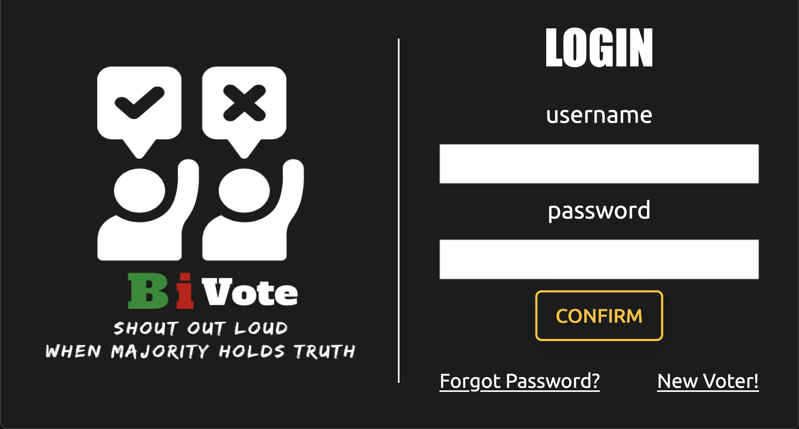

- **Profile**

  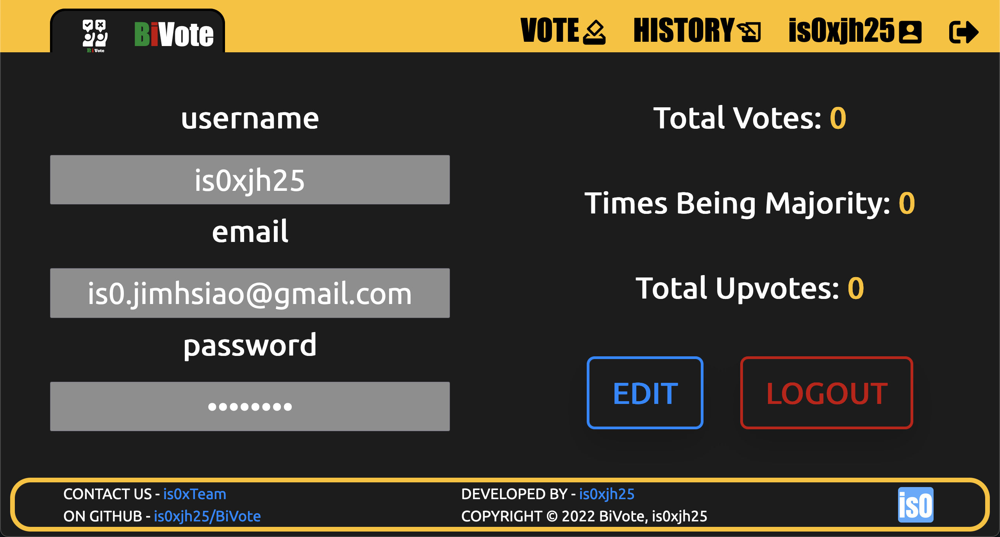

- **Home**

  

- **Vote Entry**

  

- **Vote**

  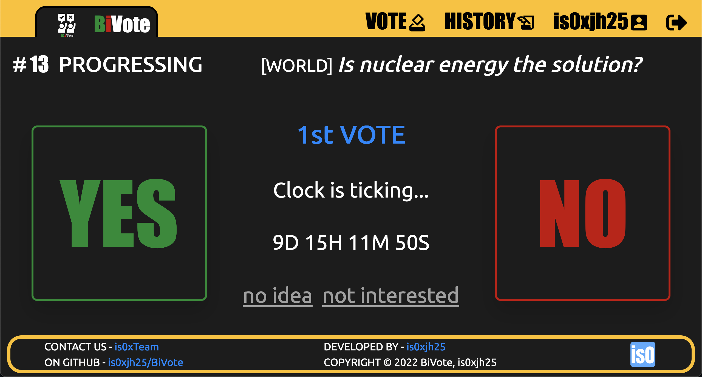

- **Result**

  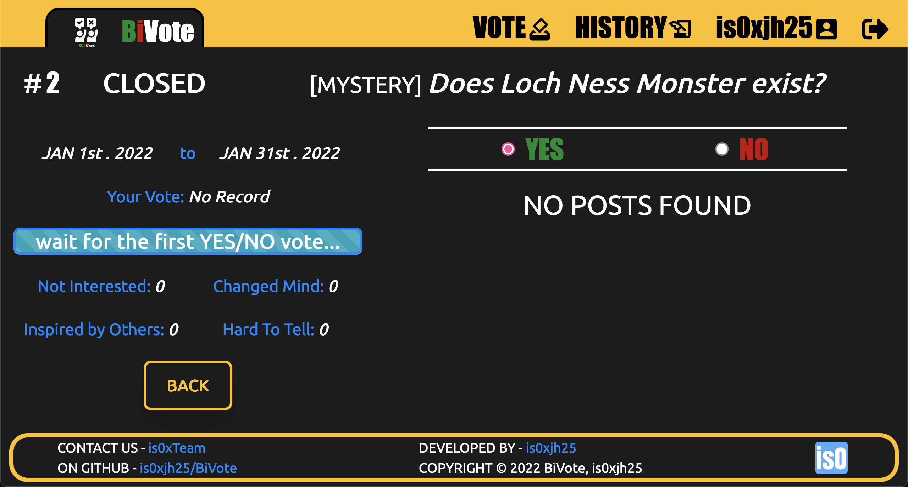

- **Post**

  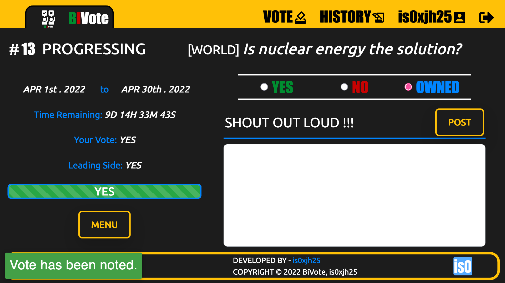

- **History**

  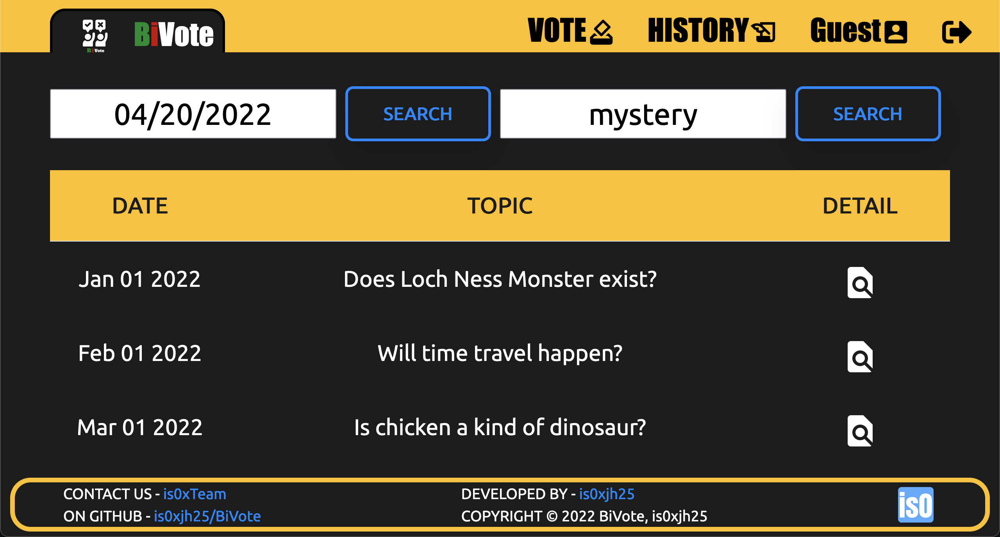

- **Responsive Design - Mobile**

  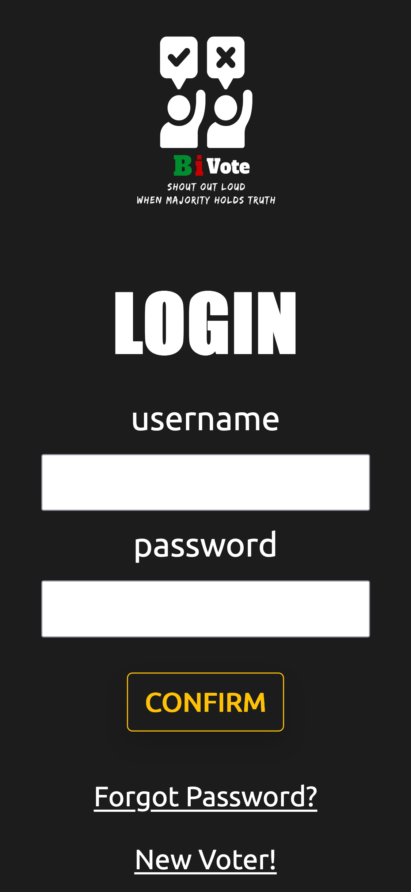
  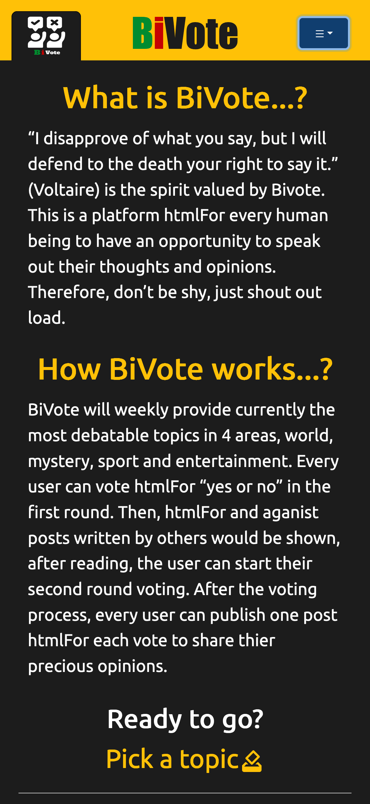
  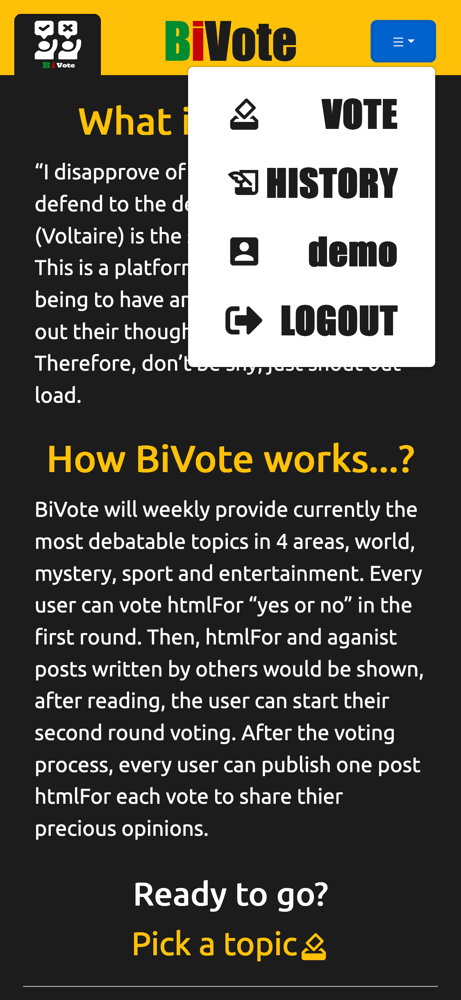

- **Responsive Design - Tablet**

  
  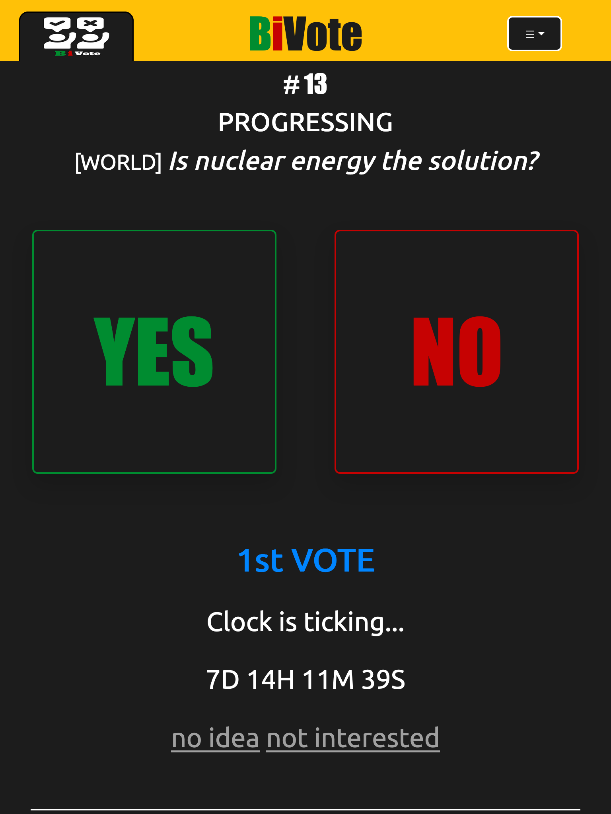

## Developed By
- The application is developed by _[is0xjh25 (Yun-Chi Hsiao)](https://is0xjh25.github.io)_ 
 

  
